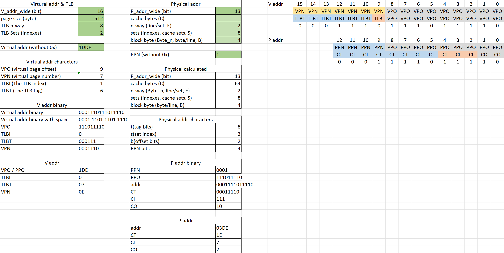

# CSAPP-cache-visualization

Several tools to help understanding and visualizing the cache concepts covered in CSAPP and ANU COMP2310 course.

## Tools

### DirectMappedCacheSimulator

A java program to illustrate the read and write on direct mapped cache. With java debugger, it is easy to discover what is happening in the cache.

#### Example

Question from ANU-COMP2310:

> Given direct mapped cache of size 64K with block size of 16 bytes, and the code

```c
void copy_matrix(int dest[ROWS][COLS], int src[ROWS][COLS]) {
  int i, j;
  for (i = 0; i < ROWS; i++) {
    for (j = 0; j < COLS; j++) {
      dest[i][j] = src[i][j];
    }
  }
}
```

> What is the cache miss rate if ROWS = 128 and COLS = 192?  

Following code in `Main.java` can illustrate the access pattern and 

```java
    public static void main(String[] args) {
        int ROWS = 192;
        int COLS = 128;
        long src = 0L; // start addr of src
        long dest = src + ROWS * COLS * 4; // start addr of dest
        DirectMappedCache cache = new DirectMappedCache(64 * 1024, 16); // initialize the cache
        // rewrite the routine in term of read and write
        for (int j = 0; j < COLS; j++) {
            for (int i = 0; i < ROWS; i++) {
                cache.read(src + i * COLS * 4 + j * 4);
                cache.write(dest + i * COLS * 4 + (COLS - 1 - j) * 4);
            }
        }
        // printout the finial hit / miss
        cache.outputSummary();
    }
```

When we step over in debugger, we can see how cache line's content change 


Each cache line in the form`cache cache index, valid, start addr, end addr`.

After all, `cache.outputSummary();` will give the summary

```
Hit ratio: 	0.25
Miss ratio:	0.75
Hit: 	12288
  Read Hit: 	6144
  Write Hit: 	6144
Miss: 	36864
  Read Miss: 	18432
  Write Miss: 	18432
```

### virtual addresses translator.xlsx

Just fill in the data in the green cells. 

Try changing the data and see how this affects the virtual address. This table gives me an intuition for virtual memory.



### Cache lookups.c

The question might give an table of cache,

| Set index | Tag  | Valid | Byte 0 | Byte 1 | Byte 2 | Byte 3 |
| --------- | ---- | ----- | ------ | ------ | ------ | ------ |
| 0         | 0    | 1     | 21     | 12     | 90     | 82     |
|           | 83   | 1     | A2     | 89     | 12     | D3     |
| 1         | 0    | 1     | 12     | 32     | 31     | 27     |
|           | 83   | 0     | —      | —      | —      | —      |

and corresponding physical address wide. Suppose the address wide is 11 in our question.

The complied `cache lookups.c` can illustrate format of such cache:


Also, given an physical address like `0x419`, it can figure out the corresponding information:


According to these information, we can find the value `89` in the cache table.

